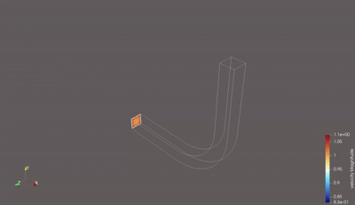

# PICurv

A parallel, high-performance Particle-In-Cell (PIC) solver with curvilinear coordinate support.

PICurv enables efficient simulation of particle-laden flows in complex geometries by combining state-of-the-art numerical methods with high-performance parallel computing. Perfect for multiphase flow simulations, plasma physics, and particle transport phenomena in curved geometries.



## Overview

PICurv is a scientific computing application that combines Eulerian grid-based fluid dynamics with Lagrangian particle tracking using the PIC (Particle-In-Cell) method. It features:

- Parallel execution using MPI and PETSc
- Curvilinear coordinate system support
- Flexible boundary condition handling
- Turbulence modeling (LES/RANS)
- Advanced particle tracking algorithms
- VTK-compatible output for visualization

## Prerequisites

- C compiler (GCC/Clang)
- MPI implementation (OpenMPI/MPICH)
- PETSc library
- GNU Make
- Doxygen (for documentation)

## Building

1. Set required environment variables:
```sh
export PETSC_DIR=/path/to/petsc
export PETSC_ARCH=arch-linux-c-debug
```

2. Build the project:
```sh
# For local development
make

# For cluster deployment
make SYSTEM=cluster
```

## Running a Simulation

1. Create a simulation directory:
```sh
mkdir my_simulation
cd my_simulation
mkdir logs results
```

2. Copy configuration files:
```sh
cp -r /path/to/picurv/test/flow_solver_test/config .
```

3. Link the executable:
```sh
ln -s /path/to/picurv/bin/picsolver .
```

4. Run the simulation:
```sh
# Local run with 4 processes
make run NPROCS=4

# Cluster run with 64 processes
make run SYSTEM=cluster NPROCS=64
```

## Directory Structure

```
├── bin/           # Compiled executables
├── docs/          # Documentation
├── include/       # Header files
├── src/           # Source files
├── test/          # Test cases
└── config.*.mk    # Build configurations
```

## Documentation

Generate documentation using:
```sh
make build-docs
```

View documentation in a web browser:
```sh
make open-docs
```

## License

MIT License

## Authors

Vishal Indivar Kandala
