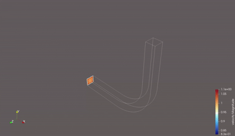

# PICurv

A parallel Eulerian-Lagrangian solver for incompressible flow and particle transport on curvilinear structured grids.



## What It Provides

- Incompressible flow solve (fractional-step projection) on curvilinear grids
- Particle tracking with PETSc `DMSwarm`
- Grid-particle interpolation and particle-grid projection
- Analytical flow modes for verification (`TGV3D`, `ZERO_FLOW`)
- YAML-driven orchestration through the conductor (`./scripts/picurv`, installed to `./bin/picurv` after build)
- Slurm job generation/submission from YAML (`cluster.yml`)
- Staged Slurm workflows with `--no-submit`, delayed `submit`, and run-directory-based `cancel`
- Graceful final snapshot writes on early shutdown signals (`SIGUSR1`, `SIGTERM`, `SIGINT`) at safe checkpoints
- Parameter sweep orchestration with Slurm arrays (`study.yml`)
- Solver and postprocessor executables from one build system

## Requirements

- PETSc build available via `PETSC_DIR` (and `PETSC_ARCH` when required by your install)
- C toolchain + MPI (`gcc/clang`, `mpicc`, GNU Make)
- Python 3.10+ with `pyyaml` and `numpy`
- Optional for plotting in sweep post-processing: `matplotlib`

Automated setup (recommended):
```bash
export PETSC_DIR=/path/to/petsc
export PETSC_ARCH=arch-linux-c-debug
./scripts/bootstrap_install.sh
```
If PETSc is not installed yet:
```bash
./scripts/bootstrap_install.sh --install-petsc
```

## Quick Start (Local)

1. Set PETSc environment variables:
```bash
export PETSC_DIR=/path/to/petsc
export PETSC_ARCH=arch-linux-c-debug
```

2. Build:
```bash
./scripts/picurv build
```

3. Add `picurv` to your PATH (one-time):
```bash
echo 'source /path/to/PICurv/etc/picurv.sh' >> ~/.bashrc
source ~/.bashrc
```

After build, `picurv` is available as a command from any directory.

4. Initialize an example:
```bash
./bin/picurv init flat_channel --dest my_case
```

`init` creates the case directory with config files. Runtime binaries (`simulator`, `postprocessor`)
are resolved from the project `bin/` directory via PATH — no copies are placed in the case.
`init` also writes `.picurv-origin.json`, which records the source repo path so maintenance
commands can rebuild, pull, and resync from the original code directory.
`picurv` treats `case.yml`, `solver.yml`, `monitor.yml`, and `post.yml` as modular profiles.
You can reuse and recombine them instead of rewriting a monolithic config for every run.

5. Validate configs (no run yet):
```bash
./bin/picurv validate \
  --case my_case/flat_channel.yml \
  --solver my_case/Imp-MG-Standard.yml \
  --monitor my_case/Standard_Output.yml \
  --post my_case/standard_analysis.yml
```

6. Preview planned launch/artifacts:
```bash
./bin/picurv run --solve --post-process \
  --case my_case/flat_channel.yml \
  --solver my_case/Imp-MG-Standard.yml \
  --monitor my_case/Standard_Output.yml \
  --post my_case/standard_analysis.yml \
  --dry-run
```

7. Run solver + post:
```bash
./bin/picurv run --solve --post-process -n 4 \
  --case my_case/flat_channel.yml \
  --solver my_case/Imp-MG-Standard.yml \
  --monitor my_case/Standard_Output.yml \
  --post my_case/standard_analysis.yml
```
`-n/--num-procs` applies to the solver stage. Post-processing defaults to single-rank execution. `picurv init` now creates an inert `.picurv-execution.yml` in each new case; leave it unchanged for ordinary local runs, or edit it when your login node / cluster needs custom MPI launcher tokens. For a cluster-specific clone, the clean setup is to create one ignored repo-root `.picurv-execution.yml`; `init` will seed new cases from it automatically, and `sync-config` will create a missing case-local file from it without overwriting existing case-local edits. Existing cases can still start from [execution.example.yml](config/runtime/execution.example.yml). Local multi-rank precedence is: `PICURV_MPI_LAUNCHER`, then `MPI_LAUNCHER`, then nearest `.picurv-execution.yml`, then legacy `.picurv-local.yml`, then default `mpiexec`. Cluster job generation uses `cluster.yml.execution` first, then `.picurv-execution.yml`, then the built-in cluster default.
For batch-policy files, prefer local operational names such as `short_job.local.yml` / `long_job.local.yml` instead of committing account/module-specific scheduler profiles.

## Case Maintenance

After `init`, you can operate on the original source repo from anywhere using `picurv` on PATH:

```bash
picurv status-source --case-dir my_case  # inspect code/template drift before syncing
picurv build                             # rebuild in the source repo (defaults to `make all`)
picurv build clean-project               # clean in the source repo
picurv pull-source --case-dir my_case    # git pull --rebase in the source repo
picurv sync-binaries --case-dir my_case  # pin specific binary versions into the case (optional)
picurv sync-config --case-dir my_case    # copy updated template files, preserve modified files
picurv sync-config --case-dir my_case --overwrite
picurv sync-config --case-dir my_case --prune  # remove stale template-managed files
```

If the case predates `.picurv-origin.json`, pass `--source-root /path/to/PICurv`.
If `sync-config` cannot infer the template, also pass `--template-name <example_name>`.
`--prune` only removes files previously tracked as template-managed, so user-created files are left alone.

## Cluster and Sweep Workflow

Run on a cluster (Slurm):
```bash
./bin/picurv run --solve --post-process \
  --case my_case/flat_channel.yml \
  --solver my_case/Imp-MG-Standard.yml \
  --monitor my_case/Standard_Output.yml \
  --post my_case/standard_analysis.yml \
  --cluster my_case/slurm_cluster.yml
```

Stage scripts first, then submit later from the generated run directory:
```bash
./bin/picurv run --solve --post-process \
  --case my_case/flat_channel.yml \
  --solver my_case/Imp-MG-Standard.yml \
  --monitor my_case/Standard_Output.yml \
  --post my_case/standard_analysis.yml \
  --cluster my_case/slurm_cluster.yml \
  --no-submit

./bin/picurv submit --run-dir runs/<run_id>
./bin/picurv cancel --run-dir runs/<run_id> --stage solve
./bin/picurv summarize --run-dir runs/<run_id> --latest
```

Launch a sweep study:
```bash
./bin/picurv sweep \
  --study my_case/grid_independence_study.yml \
  --cluster my_case/slurm_cluster.yml
```

If a study was staged with `--no-submit`, submit it later with:

```bash
./bin/picurv submit --study-dir studies/<study_id>
```

If any case is killed (e.g. walltime), continue the study (optionally with a different cluster config):

```bash
./bin/picurv sweep --continue --study-dir studies/<study_id>
./bin/picurv sweep --continue --study-dir studies/<study_id> --cluster cluster_more_time.yml
```

Re-aggregate metrics manually if the automatic metrics job did not run:

```bash
./bin/picurv sweep --reaggregate --study-dir studies/<study_id>
```

Generated Slurm solver jobs now enable an automatic runtime walltime guard by default. After the
first 10 completed steps, PICurv estimates timestep cost, then exits through the same graceful
final-write path before remaining walltime gets too tight. Tune it in `cluster.yml` only when the
defaults are too conservative or too aggressive:

```yaml
execution:
  walltime_guard:
    enabled: true
    warmup_steps: 10
    multiplier: 2.0
    min_seconds: 60
    estimator_alpha: 0.35
```

Keep an early Slurm signal as a fallback for preemption/termination events or for runs that have
not finished the warmup window yet:

```yaml
execution:
  extra_sbatch:
    signal: "USR1@300"
```

Use `USR1@300` for `srun`-launched jobs. If your batch script launches `mpirun` directly, use
`signal: "B:USR1@300"` and prefer `exec mpirun ...` so the signal reaches `mpirun` and is
forwarded to all ranks. Both the automatic guard and the signal path stop only at safe checkpoints,
so the retained state may lag the signal/request by up to roughly one in-flight timestep.
The startup banner reports whether the runtime walltime guard is enabled, inactive, or disabled,
so production monitor profiles can stay at `WARNING` without hiding that status.

## CLI Option References

For exact current options, always use script-local help:

```bash
./bin/picurv --help
./bin/picurv run --help
./bin/picurv submit --help
./bin/picurv cancel --help
./bin/picurv validate --help
./bin/picurv sweep --help
python3 scripts/grid.gen --help
python3 scripts/grid.gen legacy1d --help
```

Helper script help:

- `python3 scripts/audit_ingress.py --help`
- `python3 scripts/check_markdown_links.py --help`
- `python3 scripts/python_coverage_gate.py --help`
- `python3 scripts/c_coverage_gate.py --help`
- `python3 scripts/generate_doxygen_fallback_indexes.py --help`
- `python3 scripts/convert_grid_from_legacy_to_picgrid.py --help`
- `bash scripts/bootstrap_install.sh --help`

Detailed long-form option docs:

- `picurv`: https://vishalkandala.me/picurv-docs/05_The_Conductor_Script.html
- `grid.gen`: https://vishalkandala.me/picurv-docs/48_Grid_Generator_Guide.html
- testing/coverage context: https://vishalkandala.me/picurv-docs/40_Testing_and_Quality_Guide.html

## Generated Artifacts

- Single run:
  - `runs/<run_id>/config/` generated C-facing runtime artifacts (`*.control`, `bcs*.run`, `post.run`, etc.)
  - `runs/<run_id>/scheduler/` scheduler scripts/manifests when cluster mode is used
  - `runs/<run_id>/visualization/` and/or post outputs
- Parameter sweep:
  - `studies/<study_id>/cases/` materialized case variants
  - `studies/<study_id>/scheduler/` array scripts and submission metadata
  - `studies/<study_id>/results/metrics_table.csv` and plots

## Testing

PICurv uses an intent-based local testing model so the command name tells you what kind of validation you are running.

The Python-side CLI suites explicitly cover help/parser and behavior paths for
`submit`, `cancel`, `summarize`, and `sweep`, plus real CLI wrapper execution for
`build`, `sync-binaries`, `sync-config`, `status-source`, and `pull-source`.

Canonical targets:

- `make test-python`: Python-only CLI/config regression suite
- `make test`: backward-compatible alias to `test-python`
- `make coverage-python`: dependency-free Python line-coverage gate for core runtime scripts
- `make coverage-c`: gcov-backed C line-coverage gate (`unit + smoke` with `COVERAGE=1`)
- `make coverage`: runs `coverage-python` then `coverage-c`
- `make doctor`: installation and PETSc provisioning validation
- `make unit`: full isolated C unit/component suite
- `make unit-geometry`
- `make unit-setup`
- `make unit-solver`
- `make unit-particles`
- `make unit-io`
- `make unit-post`
- `make unit-grid`
- `make unit-metric`
- `make unit-boundaries`
- `make unit-poisson-rhs`
- `make unit-runtime`
- `make unit-simulation`: aggregate simulation-core debugging target (`unit-boundaries + unit-solver + unit-poisson-rhs + unit-runtime + unit-particles`)
- `make unit-mpi`: dedicated multi-rank MPI consistency tests (`TEST_MPI_NPROCS`, default 2)
- `make unit-periodic-dev`: non-gating periodic-boundary development harness
- `make smoke`: executable-level end-to-end smoke checks (template matrix + flat/bent/brownian tiny runtime sequences)
- `make smoke-mpi`: multi-rank runtime smoke checks for tiny flat+bent solve/post plus flat particle+restart workflows (`SMOKE_MPI_NPROCS`, default 2)
- `make smoke-mpi-matrix`: multi-rank runtime smoke across a rank matrix (`SMOKE_MPI_MATRIX_NPROCS`, default `2 3`)
- `make smoke-stress`: opt-in medium-budget smoke extension tier (particle cycling, restart chain, parabolic-inlet runtime coverage, periodic constant-flux validate/dry-run coverage, extra-rank MPI particle stress)
- `make smoke-periodic-dev`: non-gating periodic runtime harness for the in-development periodic BC path
- `make check`: full local validation sweep (`test-python + doctor + unit + smoke`)
- `make check-mpi`: `make check` plus multi-rank MPI tests
- `make check-mpi-matrix`: `make check` plus rank-matrix MPI smoke and `unit-mpi`
- `make check-full`: comprehensive local gate (`check + unit-mpi + smoke-mpi + smoke-mpi-matrix`)
- `make check-stress`: `make check-full` plus `smoke-stress`

Compatibility aliases:

- `make install-check` -> `make doctor`
- `make ctest` -> `make unit`
- `make ctest-setup` -> `make unit-setup`
- `make ctest-geometry` -> `make unit-geometry`
- `make ctest-solver` -> `make unit-solver`
- `make ctest-particles` -> `make unit-particles`
- `make ctest-io` -> `make unit-io`
- `make ctest-post` -> `make unit-post`
- `make ctest-grid` -> `make unit-grid`
- `make ctest-metric` -> `make unit-metric`
- `make ctest-boundaries` -> `make unit-boundaries`
- `make ctest-poisson-rhs` -> `make unit-poisson-rhs`
- `make ctest-runtime` -> `make unit-runtime`
- `make ctest-mpi` -> `make unit-mpi`

Quick-start commands:

```bash
python3 scripts/audit_function_docs.py
make test
make doctor
make unit-setup
make unit-simulation
make unit-mpi
make unit-periodic-dev
make coverage-python
make smoke
make smoke-periodic-dev
make check
make check-full
```

Use `make doctor` after provisioning PETSc to confirm the local toolchain can build and run a minimal PETSc-backed program. Use `make unit-setup` for setup/cleanup lifecycle coverage, `make unit-simulation` for the normal simulation-core debugging loop, and narrower `make unit-*` targets when you are isolating one subsystem. The shared C test layer now has two fixture styles: a fast minimal PETSc fixture for kernel tests and a richer tiny-runtime fixture built through the real setup path for behavior and orchestrator tests. Use `make smoke` to run template-matrix init/validate/dry-run coverage across `flat_channel`, `bent_channel`, and `brownian_motion` plus tiny real runtime workflows (flat with/without particles, bent-channel solve/post, restart `load/init`, restart-equivalence split-vs-continuous, analytical Brownian). Use `make smoke-mpi` for multi-rank runtime smoke on flat+bent plus flat particle/restart branches, `make smoke-mpi-matrix` for rank-sweep runtime smoke, and `make smoke-stress` for the opt-in medium-budget extension tier. Periodic BC work is intentionally non-gating for now: `make unit-periodic-dev` and `make smoke-periodic-dev` are the dedicated development harnesses, and failures there do not block `check`, `check-full`, or `coverage-c`. Use `make coverage` for line-coverage gates. Use `make check` at the end of a development cycle, `make check-mpi`/`make check-mpi-matrix` when multi-rank assertions are in scope, `make check-full` before release tagging, and `make check-stress` when you also want the stress layer.

Smoke treats `bin/simulator -help` and `bin/postprocessor -help` as successful
when the expected startup banner appears, even if the local PETSc build exits
with code `62` (`PETSC_ERR_ARG_WRONG`).

Current next-gap backlog:

- walking search:
  - add direct bespoke tests for `LocateParticleOrFindMigrationTarget` boundary clamp, ghost-region handoff, stuck/tie-breaker, `LOST`, and `MIGRATING_OUT` outcomes
  - add direction-complete and failure-path coverage for the `GuessParticleOwnerWithBBox` heuristic
- particle migration:
  - add non-restart MPI handoff tests for multi-pass migration, newcomer flagging, and count conservation
- momentum solvers:
  - add direct positive-path coverage for `MomentumSolver_Explicit_RungeKutta4`
  - add a small invariant-style direct harness for the positive `MomentumSolver_DualTime_Picard_RK4` path so debugging does not rely only on smoke
- pressure/Poisson:
  - add more direct `PoissonSolver_MG` and periodic/IBM stencil behavior checks beyond the current `unit-poisson-rhs` helper coverage
- grid/metrics/setup:
  - broaden the richer runtime fixture coverage to more geometry/topology variants; current contracts are strong, but still mostly tiny Cartesian cases

Repository contract note:

- `python3 scripts/audit_function_docs.py` enforces Doxygen-style function documentation coverage for C and Python code, including tests.
- GitHub Actions now runs that audit explicitly before `pytest -q`, then runs markdown link checks on pull requests and pushes to `main`.

Detailed guide:
- https://vishalkandala.me/picurv-docs/40_Testing_and_Quality_Guide.html

## Documentation (Live)

- Docs home: https://vishalkandala.me/picurv-docs/
- Getting started index: https://vishalkandala.me/picurv-docs/41_Getting_Started_Index.html
- 10-minute start: https://vishalkandala.me/picurv-docs/38_Start_Here_10_Minutes.html
- Installation guide: https://vishalkandala.me/picurv-docs/01_Installation.html
- Conductor CLI: https://vishalkandala.me/picurv-docs/05_The_Conductor_Script.html
- Workflow recipes and config cookbook: https://vishalkandala.me/picurv-docs/49_Workflow_Recipes_and_Config_Cookbook.html
- Config contract: https://vishalkandala.me/picurv-docs/14_Config_Contract.html
- Config ingestion map: https://vishalkandala.me/picurv-docs/15_Config_Ingestion_Map.html
- Grid generator guide: https://vishalkandala.me/picurv-docs/48_Grid_Generator_Guide.html
- Extension playbook: https://vishalkandala.me/picurv-docs/16_Config_Extension_Playbook.html
- Cluster guide: https://vishalkandala.me/picurv-docs/36_Cluster_Run_Guide.html
- Sweep guide: https://vishalkandala.me/picurv-docs/37_Sweep_Studies_Guide.html
- Testing and quality: https://vishalkandala.me/picurv-docs/40_Testing_and_Quality_Guide.html
- C test suite developer guide: https://vishalkandala.me/picurv-docs/51_C_Test_Suite_Developer_Guide.html
- Common fatal errors: https://vishalkandala.me/picurv-docs/39_Common_Fatal_Errors.html
- Repository navigation: https://vishalkandala.me/picurv-docs/30_Repository_Navigation.html

## Repository Navigation

Top-level guides:
- `config/guide.md`
- `docs/guide.md`
- `examples/guide.md`
- `include/guide.md`
- `src/guide.md`
- `scripts/guide.md`
- `sandbox/guide.md`
- `logs/guide.md`

Build config location:
- `config/build/` (`config.local.mk`, `config.cluster.mk`, `config.petsc.mk`)

Grid profile library:
- `config/grids/` (shared `grid.gen` configs)

Scheduler/study profiles:
- `config/schedulers/`
- `config/studies/`

Build docs locally (if dependencies are available):
```bash
make build-docs
```

Docs output:
- `docs_build/html/index.html`

Doxygen warnings log:
- `logs/doxygen.warnings`

## Notes

- Only one `README.md` is maintained at repository root.
- Internal per-directory usage notes are standardized as `guide.md`.
