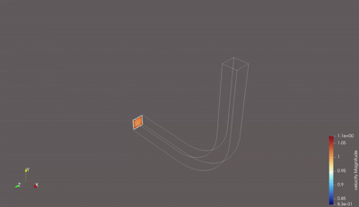
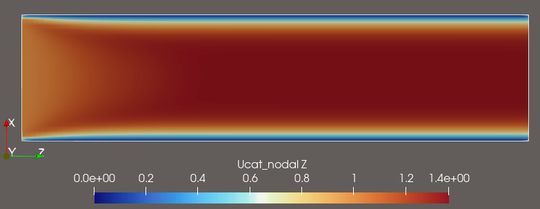

@mainpage PICurv Solver Documentation

PICurv is a parallel CFD and particle-transport framework for incompressible flow
and scalar transport on structured curvilinear grids. It couples a PETSc `DMDA`
Eulerian flow solve to `DMSwarm` Lagrangian particle transport, and it is driven
entirely by YAML: you compose `case.yml`, `solver.yml`, `monitor.yml`, and
`post.yml` rather than editing code for each run.

@note **Version 0.1.0 - development documentation.** This site documents the
current `main` branch, not a tagged release. The footer names the exact commit it
was built from. See @subpage 62_Capability_Status_Vocabulary for what the status
words on these pages mean.

@section mainpage_start_sec Start here

**@subpage 41_Getting_Started_Index** - install, build, and complete one validated
example run end to end. This is the fastest route to a working simulation and the
right first click for almost everyone.

You will need PETSc (with `PETSC_DIR` set; `PETSC_ARCH` only for old-style in-tree
builds), an MPI runtime, and Python 3.10 or newer for the managed CLI bootstrap. Runs work locally on a workstation, under MPI, and on a Slurm
cluster. Example run costs have not yet been measured; see **@subpage 65_Example_Catalog**.

@section mainpage_routes_sec Then pick your route

| I want to... | Go to |
|---|---|
| Set up and run my own case | **@subpage 42_User_Guide_Index** |
| Know what PICurv can and cannot do yet | **@subpage 12_Capabilities_Summary** |
| Understand the numerics and models | **@subpage 21_Methods_Overview** |
| Look up exact YAML keys and CLI options | **@subpage 14_Config_Contract** |
| Run on a cluster, restart, sweep, or archive | **@subpage 52_Run_Lifecycle_Guide** |
| Extend or contribute to the code | **@subpage 43_Developer_Portal_Index** |
| Diagnose a failing run | **@subpage 67_Troubleshooting** |
| See what evidence stands behind a capability | **@subpage 66_Evidence_Matrix** |
| Find a specific page | **@subpage Documentation_Map** |

@section mainpage_preview_sec What a run produces

@htmlonly

  

  

@endhtmlonly

@section mainpage_method_sec How it works, in brief

PICurv advances a coupled Eulerian-Lagrangian system:

1. **Eulerian phase** - velocity and pressure evolve on a structured curvilinear
   grid through a fractional-step scheme.
2. **Lagrangian phase** - particles move through that field, carrying scalar
   quantities with them.
3. **Coupling** - grid-to-particle interpolation drives advection and source
   evaluation; the particle-to-grid scatter path writes particle-derived scalars back
   onto the grid. Momentum feedback from particles to the flow is not part of the
   current path.

@subpage 06_Simulation_Anatomy traces one run from YAML through generated
artifacts to output. @subpage 46_C_Runtime_Execution_Map follows the same path
down into the C runtime.

@section mainpage_scope_sec Current scope

Supported today: incompressible flow on curvilinear grids; programmatic, file, and
generated grid ingestion; selectable momentum solvers including Newton-Krylov;
geometric and driven periodic boundaries; Lagrangian particle transport; online
field statistics; and Slurm submission with parameter sweeps.

Not yet supported: compressible flow, multiphase flow, mesh adaptation, and an
immersed-boundary capability beyond the metric-level hooks already present.

Recent contract and behavior changes are recorded in **@subpage 18_Changelog**.
